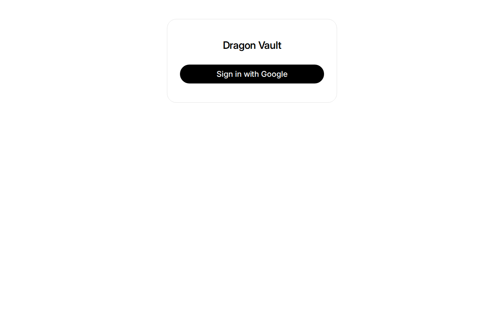
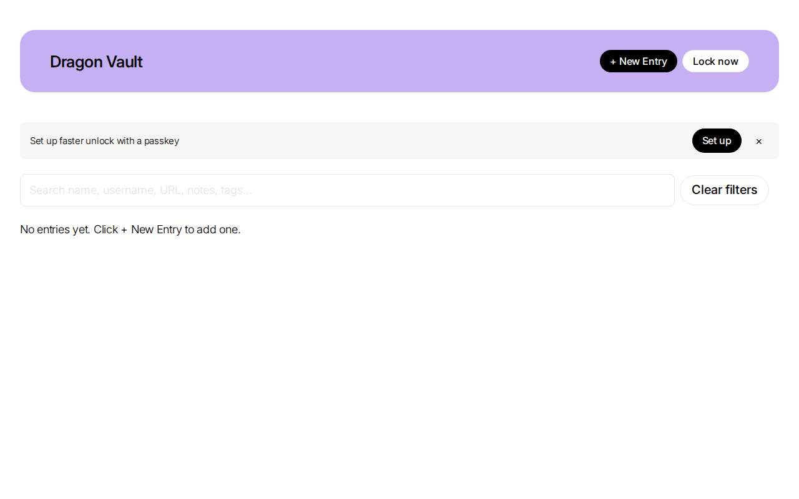
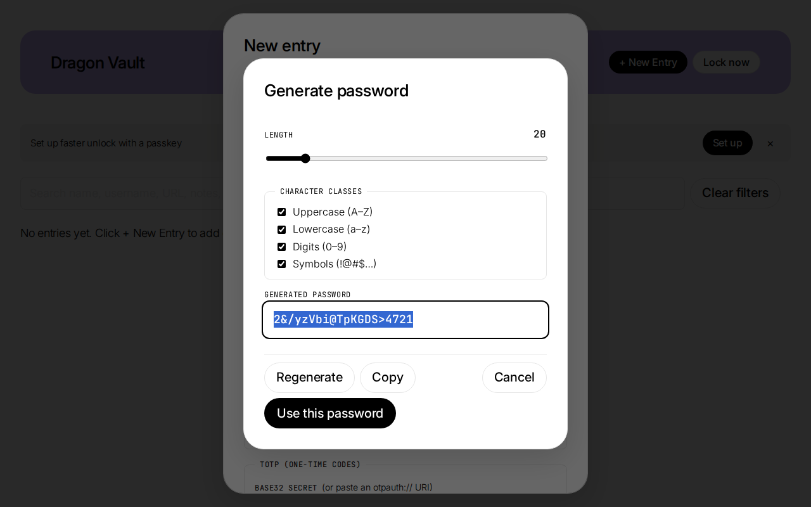

# Dragon Vault

A **zero-knowledge, single-user password manager** built with ASP.NET Core 10 and
vanilla JavaScript. The server never sees your passwords — all encryption happens
in your browser. Installable as a PWA on Android and desktop.


---

## Features

- **Zero-knowledge encryption** — Argon2id + AES-GCM 256, entirely client-side
- **Google OAuth sign-in** with configurable email allowlist
- **WebAuthn passkey unlock** — auto-launches on devices with biometrics
- **Master password** with 32-character paper recovery code
- **TOTP (authenticator)** — SHA-1/256/512, 6-digit codes with countdown ring
- **Have I Been Pwned** k-anonymity breach check
- **Password generator** with configurable length and character classes
- **Custom fields** with sort ordering
- **Password history** — retains last 5 passwords per entry
- **Auto-lock** after 15 minutes idle, cross-tab lock coordination
- **PWA** — install to home screen, offline shell
- **Dark mode** — auto-detected from OS preference

---

## Screenshots

| Login | Vault Entries |
|-------|---------------|
|  |  |



---

## Prerequisites

- **.NET 10.0 SDK** — [download](https://dotnet.microsoft.com/download/dotnet/10.0)
- **SQL Server 2022** — Docker recommended
- **nginx** (Linux) or **IIS** (Windows) for reverse proxy
- **certbot** (Linux) or **win-acme** (Windows) for Let's Encrypt TLS
- **Google OAuth 2.0 credentials** — see [Google OAuth Setup](#google-oauth-setup)

---

## Quick Start (Linux)

### 1. Clone

```bash
git clone https://github.com/builtwithclaudetech/dragon-vault.git
cd dragon-vault
```

### 2. Configure placeholders

Read `PLACEHOLDERS.md` and replace every placeholder with your own values.

### 3. Create dev config

Create `src/PasswordManager.Web/appsettings.Development.json`:

```json
{
  "ConnectionStrings": {
    "DragonVault": "Server=localhost;Database=DragonVault;User Id=sa;Password=YOUR_SQL_PASSWORD;TrustServerCertificate=True;Encrypt=True"
  },
  "Authentication": {
    "Google": {
      "ClientId": "YOUR_GOOGLE_CLIENT_ID",
      "ClientSecret": "YOUR_GOOGLE_CLIENT_SECRET"
    }
  }
}
```

### 4. Build and test

```bash
cd src
dotnet restore
dotnet build
dotnet test
```

All 83 tests should pass.

### 5. Run locally

```bash
cd src/PasswordManager.Web
dotnet run
```

The app starts at `https://localhost:5001`.

---

## Production Deployment (Linux)

### Directory structure

```bash
sudo bash deploy/setup-directories.sh
```

### SQL Server (Docker)

```bash
docker run -d --name sqlserver \
  -e 'ACCEPT_EULA=Y' \
  -e 'MSSQL_SA_PASSWORD=YOUR_PASSWORD' \
  -p 127.0.0.1:1433:1433 \
  -v /opt/sqlserver/data:/var/opt/mssql \
  mcr.microsoft.com/mssql/server:2022-latest
```

### nginx + TLS

```bash
sudo bash deploy/install-nginx.sh
sudo bash deploy/setup-certbot.sh
```

### Publish and start

```bash
cd src
sudo dotnet publish PasswordManager.Web/PasswordManager.Web.csproj -c Release -o /var/opt/dragonvault/publish/
sudo chown -R www-data:www-data /var/opt/dragonvault/publish
sudo bash deploy/install-systemd.sh
sudo systemctl enable --now dragonvault
```

Verify: `curl https://your-domain.com/healthz` returns `OK`.

### Nightly backups

```bash
sudo bash deploy/install-backup.sh
```

---

## Google OAuth Setup

1. Go to https://console.cloud.google.com/apis/credentials
2. Create a project → **OAuth consent screen** (External)
3. Add your email as a test user
4. **Create Credentials** → OAuth client ID (Web application)
5. Authorized redirect URI: `https://your-domain.com/signin-google`
6. Copy Client ID and Client Secret to your config

---

## Usage

### First sign-in

1. Navigate to `https://your-domain.com` → **Sign in with Google**
2. On the Setup page, choose a master password (≥ 12 characters)
3. **Save the 32-character recovery code** — shown only once
4. Type the recovery code back to confirm → **Continue**

### Unlocking

- **Passkey**: Auto-launches if registered. Touch your authenticator.
- **Master password**: Enter password → **Unlock**

### Managing entries

- **New Entry**: **+ New Entry** → fill fields → **Save**
- **Edit/Delete**: Click any entry in the list
- **Search**: Type to filter by name, username, URL, notes, or tags
- **Tags**: Click tag pills to filter

### Password generator

Click **Generate** next to any password field. Set length (8-128) and character classes.

### TOTP (Authenticator)

Add a custom field of type **totp_secret** with your TOTP secret. Codes display with a countdown ring.

### HIBP breach check

Click **Check breaches** next to any password. Only the first 5 characters of the SHA-1 hash leave your browser.

### Passkeys

1. Unlock → click **Set up faster unlock with a passkey**
2. Enter master password → touch authenticator
3. Next unlock auto-launches the passkey

### Recovery

1. On Unlock page → **Forgot your master password?**
2. Enter 32-character recovery code
3. Choose new master password → **Recover**

---

## Building on Windows

```powershell
cd src
dotnet restore
dotnet build
dotnet test
cd PasswordManager.Web
dotnet run
```

For IIS deployment, see `PLACEHOLDERS.md` for Windows-specific paths.

---

## Project Structure

```
src/
  PasswordManager.Core/     Domain models, interfaces (no framework deps)
  PasswordManager.Data/     EF Core DbContext, migrations, audit interceptor
  PasswordManager.Web/      ASP.NET Core 10 app, Razor views, PWA, WebAuthn

tests/
  PasswordManager.Tests.Unit/         xUnit + Moq
  PasswordManager.Tests.Integration/  xUnit + WebApplicationFactory

deploy/                    Deployment scripts, nginx config, systemd units
docs/                      Public documentation
```

## Architecture

See [docs/ARCHITECTURE.md](docs/ARCHITECTURE.md) for the crypto design, threat model, and deployment topology.

## Security

See [SECURITY.md](SECURITY.md) for the vulnerability disclosure process.

## License

MIT — see [LICENSE](LICENSE).
